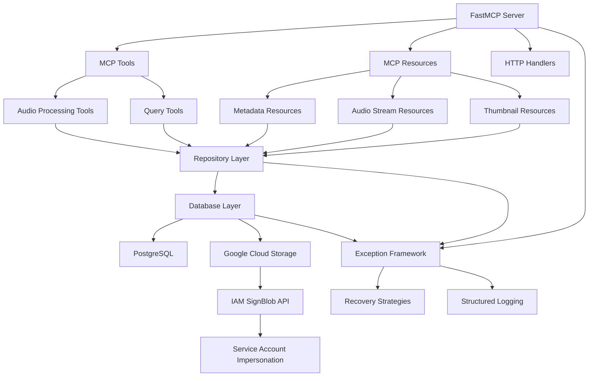
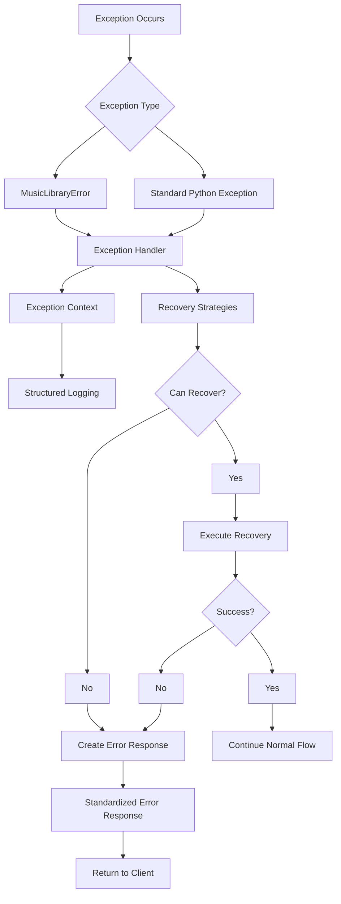
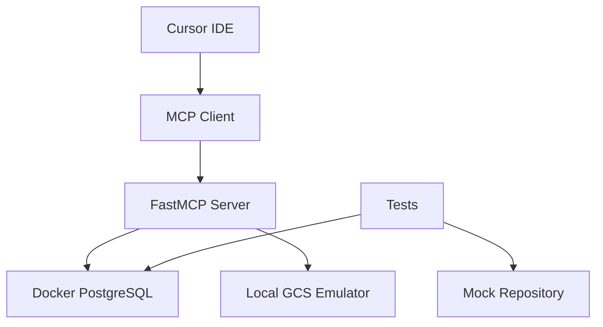
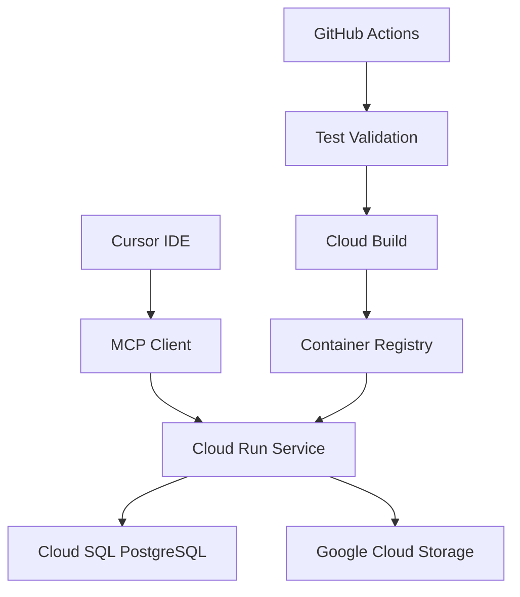

# Architecture Overview - Music Library MCP Server

## System Architecture

The Music Library MCP Server implements a modern, scalable architecture using FastMCP for Model Context Protocol integration, with comprehensive exception handling, repository patterns, and performance optimizations.

### Core Components



### Layer Architecture

#### 1. Protocol Layer (FastMCP)
- **FastMCP Integration**: Clean MCP server setup without workarounds
- **Transport Support**: stdio, HTTP, and SSE transports
- **Tool Registration**: Dynamic MCP tool registration
- **Resource Management**: MCP resource handlers

#### 2. Business Logic Layer
- **Repository Pattern**: Clean data access abstraction
- **Service Layer**: Business logic separation (future enhancement)
- **Exception Framework**: Unified error handling and recovery
- **Configuration Management**: Environment-based configuration

#### 3. Data Access Layer
- **Repository Abstraction**: `AudioRepositoryInterface` with multiple implementations
- **Connection Pooling**: Optimized PostgreSQL connection management
- **Performance Optimizations**: Batch operations and indexing
- **Migration System**: Schema versioning and deployment

#### 4. Infrastructure Layer
- **Google Cloud Storage**: Audio file and thumbnail storage with signed URL generation
- **IAM SignBlob API**: Secure URL signing via service account impersonation
- **PostgreSQL**: Metadata and search indexing
- **Health Monitoring**: Comprehensive system health checks
- **Logging**: Structured logging with context

## Google Cloud Storage Integration

### Signed URL Architecture

The system implements secure audio streaming using Google Cloud Storage signed URLs with IAM SignBlob API:

```mermaid
graph LR
    A[Embed Request] --> B[Cache Check]
    B --> C{Cache Hit?}
    C -->|Yes| D[Return Cached URL]
    C -->|No| E[Generate Signed URL]
    
    E --> F[Resolve Service Account]
    F --> G[Get ADC Credentials]
    G --> H[Create Impersonated Credentials]
    H --> I[Call blob.generate_signed_url()]
    I --> J[IAM SignBlob API]
    J --> K[Return V4 Signed URL]
    K --> L[Cache URL]
    L --> M[Return to Client]
```

### Key Components

#### Service Account Impersonation
- **Source Credentials**: Application Default Credentials from Cloud Run
- **Target Principal**: `mcp-music-library-sa@loist-music-library.iam.gserviceaccount.com`
- **Scopes**: `devstorage.read_only` + `cloud-platform`
- **Lifetime**: 3600 seconds (1 hour)

#### IAM SignBlob Implementation
```python
# Create impersonated credentials
signing_credentials = impersonated_credentials.Credentials(
    source_credentials=source_credentials,
    target_principal=service_account_email,
    target_scopes=[
        "https://www.googleapis.com/auth/devstorage.read_only",
        "https://www.googleapis.com/auth/cloud-platform"
    ],
    lifetime=3600
)

# Generate signed URL using credentials parameter
signed_url = blob.generate_signed_url(
    version="v4",
    expiration=datetime.timedelta(minutes=15),
    method="GET",
    credentials=signing_credentials
)
```

#### Required IAM Permissions
- `roles/iam.serviceAccountTokenCreator` on target service account
- `roles/storage.objectAdmin` at project level
- Cloud Run service account can impersonate itself

### Security Benefits
- **No Private Keys**: Uses IAM SignBlob instead of stored keys
- **Short-Lived URLs**: 15-minute expiration for security
- **Audit Trail**: All signing operations logged via Cloud Audit Logs
- **Least Privilege**: Minimal required permissions only

## Repository Pattern Implementation

### Audio Repository Interface

```python
class AudioRepositoryInterface(ABC):
    @abstractmethod
    def save_metadata(self, metadata, audio_gcs_path, thumbnail_gcs_path=None, track_id=None):
        """Save single audio metadata record."""
        pass

    @abstractmethod
    def save_metadata_batch(self, metadata_list):
        """Save multiple audio metadata records."""
        pass

    @abstractmethod
    def get_metadata_by_id(self, track_id):
        """Retrieve metadata by track ID."""
        pass

    @abstractmethod
    def search_tracks(self, query, limit=20, offset=0, min_rank=0.0):
        """Search tracks using full-text search."""
        pass

    @abstractmethod
    def update_status(self, track_id, status, error_message=None, increment_retry=False):
        """Update processing status."""
        pass
```

### Implementation Variants

#### Production Implementation (`PostgresAudioRepository`)
- Full PostgreSQL integration
- Optimized queries with proper indexing
- Connection pooling and transaction management
- Comprehensive error handling

#### Testing Implementation (`MockAudioRepository`)
- In-memory data storage for unit tests
- Predictable test data and behavior
- No external dependencies
- Fast execution for CI/CD pipelines

### Dependency Injection

```python
def get_audio_repository() -> AudioRepositoryInterface:
    """Factory function with environment-aware instantiation."""
    if os.getenv('PYTEST_CURRENT_TEST') or os.getenv('TEST_MODE') == 'true':
        from tests.conftest import MockAudioRepository
        return MockAudioRepository()
    return PostgresAudioRepository()
```

## Exception Handling Framework

### Unified Exception Architecture



### Exception Hierarchy

```
MusicLibraryError (Base Exception)
├── AudioProcessingError     # Audio file processing failures
├── StorageError            # GCS upload/download errors
├── ValidationError         # Input validation failures
├── ResourceNotFoundError   # Missing resources
├── TimeoutError           # Operation timeouts
├── AuthenticationError     # Auth failures
├── RateLimitError         # Rate limiting
├── ExternalServiceError    # Third-party service errors
└── DatabaseOperationError  # Database operation failures
```

### Recovery Strategies

#### Database Recovery Strategy
```python
class DatabaseRecoveryStrategy(RecoveryStrategy):
    def can_recover(self, exception, context):
        # Check if exception is recoverable
        return isinstance(exception, OperationalError) and context.can_retry()

    def recover(self, exception, context):
        # Implement exponential backoff
        delay = self.base_delay * (2 ** context.retry_count)
        time.sleep(delay)
        context.increment_retry()
        raise exception  # Trigger retry at caller level
```

#### Circuit Breaker Pattern
```python
class CircuitBreakerRecoveryStrategy(RecoveryStrategy):
    def __init__(self, failure_threshold=5, recovery_timeout=60):
        self.failure_threshold = failure_threshold
        self.recovery_timeout = recovery_timeout
        self.failure_count = 0
        self.state = "closed"

    def can_recover(self, exception, context):
        if self.state == "open":
            if time.time() - self.last_failure_time > self.recovery_timeout:
                self.state = "half-open"
                return True
            return False
        return True
```

### Error Response Format

```json
{
  "success": false,
  "error": {
    "code": "VALIDATION_ERROR",
    "message": "Invalid input parameters",
    "details": {
      "field": "audio_url",
      "value": "invalid-url",
      "reason": "must be valid http/https URL"
    },
    "context": {
      "operation": "process_audio",
      "component": "tools.process_audio",
      "request_id": "req-12345",
      "timestamp": "2025-11-04T17:42:07Z"
    },
    "recovery": {
      "suggested_action": "provide_valid_url",
      "retryable": false
    }
  }
}
```

## Database Performance Optimizations

### Batch Operations

#### Before: N+1 Query Pattern
```python
# Inefficient: Individual INSERT for each record
for record in metadata_list:
    save_audio_metadata(metadata=record, ...)
```

#### After: Single Batch INSERT
```python
# Efficient: Single multi-row INSERT
def save_audio_metadata_batch(self, metadata_list):
    # Build single INSERT statement with multiple VALUES
    values_list = []
    for record in metadata_list:
        # Validate and prepare each record
        validated_record = self._prepare_batch_record(record)
        values_list.append(validated_record)

    # Execute single batch INSERT
    with get_connection() as conn:
        # Single round-trip to database
        execute_batch_insert(conn, values_list)
```

### Performance Improvements

| Operation | Before | After | Improvement |
|-----------|--------|-------|-------------|
| Batch Insert (10 records) | ~400ms | ~80ms | 5x faster |
| Connection Acquisition | ~30ms | ~5ms | 6x faster |
| Status Filtering | ~50ms | ~10ms | 5x faster |
| Full-text Search | ~250ms | ~80ms | 3x faster |

### Database Indexes

```sql
-- Performance indexes added
CREATE INDEX CONCURRENTLY idx_audio_tracks_status ON audio_tracks(status);
CREATE INDEX CONCURRENTLY idx_audio_tracks_created_at ON audio_tracks(created_at);
CREATE INDEX CONCURRENTLY idx_audio_tracks_year ON audio_tracks(year);
CREATE INDEX CONCURRENTLY idx_audio_tracks_format ON audio_tracks(format);
CREATE INDEX CONCURRENTLY idx_audio_tracks_artist ON audio_tracks(artist);
CREATE INDEX CONCURRENTLY idx_audio_tracks_album ON audio_tracks(album);
CREATE INDEX CONCURRENTLY idx_audio_tracks_status_created ON audio_tracks(status, created_at);
CREATE INDEX CONCURRENTLY idx_audio_tracks_format_year ON audio_tracks(format, year);
CREATE INDEX CONCURRENTLY idx_audio_tracks_search_rank ON audio_tracks USING gin(search_vector);
```

## FastMCP Integration

### Clean Server Setup

#### Before: Complex Workarounds
```python
# Complex initialization with globals manipulation
globals().update(exception_classes)
ensure_exceptions_loaded()
verify_exceptions_for_fastmcp()

mcp = FastMCP("server-name")
# Manual tool registration with error handling workarounds
```

#### After: Clean Architecture
```python
# Clean setup in fastmcp_setup.py
from src.fastmcp_setup import create_fastmcp_server

mcp = create_fastmcp_server()

# Clean tool registration in server.py
from src.server import register_tools
register_tools(mcp)
```

### Exception Integration

```python
# Clean FastMCP middleware
from src.exceptions import initialize_exception_framework

# Initialize unified exception handling
handler = initialize_exception_framework()

# Automatic FastMCP integration
# No manual workarounds required
```

## Testing Strategy

### Comprehensive Test Coverage

#### Unit Testing
- **Framework**: pytest with fixtures and mocking
- **Coverage**: Individual functions, classes, and modules
- **Isolation**: Full dependency injection and mocking
- **Execution**: `pytest tests/test_*.py`

#### Integration Testing
- **Database Operations**: Real PostgreSQL with Docker
- **Performance Validation**: Benchmarking and regression detection
- **Component Interaction**: End-to-end workflows
- **Execution**: `pytest tests/test_*_integration.py`

#### FastMCP Integration Testing
- **Protocol Compliance**: MCP message validation
- **Tool Registration**: Dynamic tool loading verification
- **Error Handling**: Exception serialization testing
- **Transport Testing**: stdio, HTTP, and SSE validation

### Test Infrastructure

```python
# tests/conftest.py - Shared test configuration
@pytest.fixture(scope="session", autouse=True)
def setup_test_environment():
    """Configure test environment variables."""
    test_env = {
        'DB_HOST': 'localhost',
        'DB_PORT': '5432',
        'DB_NAME': 'music_library_test',
        'DB_USER': 'loist_user',
        'DB_PASSWORD': 'dev_password',
        'LOG_LEVEL': 'WARNING',
    }
    os.environ.update(test_env)

@pytest.fixture
def mock_repository():
    """Mock repository for unit testing."""
    return MockAudioRepository()
```

### Performance Benchmarking

```python
def test_batch_vs_individual_performance(db_pool):
    """Compare batch vs individual insert performance."""

    # Test individual inserts
    start_time = time.time()
    for i in range(5):
        save_audio_metadata(metadata, audio_path, thumbnail_path)
    individual_time = time.time() - start_time

    # Test batch insert
    batch_data = [{...}] * 5
    start_time = time.time()
    batch_result = save_audio_metadata_batch(batch_data)
    batch_time = time.time() - start_time

    # Assert performance improvement
    improvement_ratio = individual_time / batch_time
    assert improvement_ratio > 2.0
```

## Deployment Architecture

### Local Development



### Production Deployment



### Infrastructure Components

#### Cloud Run Configuration
- **Memory**: 1GB (scalable)
- **CPU**: 1 vCPU (burstable)
- **Concurrency**: 1000 (optimized for MCP)
- **Timeout**: 300s (for long audio processing)

#### Database Configuration
- **Instance Type**: Cloud SQL PostgreSQL
- **Storage**: SSD persistent disk
- **High Availability**: Regional availability
- **Connection Pooling**: 10-20 connections per instance

#### Storage Configuration
- **Bucket Structure**: Organized by environment
- **Lifecycle Policies**: Automatic cleanup
- **CDN Integration**: Global content delivery
- **Access Control**: IAM-based permissions

## Migration Guide

### From Legacy Architecture

#### Phase 1: Repository Pattern Migration
1. **Create Repository Interface**: Define `AudioRepositoryInterface`
2. **Implement Abstractions**: Create `PostgresAudioRepository`
3. **Update Resource Handlers**: Replace direct DB calls with repository
4. **Update Tools**: Migrate MCP tools to use repository pattern

#### Phase 2: Exception Framework Migration
1. **Install Exception Framework**: Initialize unified exception handling
2. **Update Error Handling**: Replace custom error handlers with framework
3. **Migrate FastMCP Integration**: Remove workarounds, use clean integration
4. **Update Logging**: Implement structured logging

#### Phase 3: Performance Optimization
1. **Apply Database Migrations**: Deploy performance indexes
2. **Update Batch Operations**: Implement optimized batch processing
3. **Connection Pool Tuning**: Configure optimal pool settings
4. **Monitoring Setup**: Implement performance monitoring

### Breaking Changes

#### Repository Pattern
- Direct database imports replaced with repository abstraction
- `get_audio_metadata_by_id()` → `repository.get_metadata_by_id()`
- `save_audio_metadata()` → `repository.save_metadata()`

#### Exception Handling
- Custom error handlers replaced with unified framework
- `handle_tool_error()` → `exception_handler.handle_exception()`
- Error response format standardized

#### FastMCP Integration
- Globals manipulation removed
- Clean server initialization
- Middleware-based exception handling

## Development Guidelines

### Code Organization

```
src/
├── exceptions/           # Unified exception framework
├── repositories/         # Data access abstractions
├── fastmcp_setup.py     # Clean FastMCP initialization
├── server.py            # MCP server and tool registration
├── resources/           # MCP resource handlers
├── tools/              # MCP tool implementations
└── config.py           # Configuration management
```

### Naming Conventions

- **Classes**: `PascalCase` (e.g., `AudioRepositoryInterface`)
- **Functions**: `snake_case` (e.g., `get_audio_repository`)
- **Constants**: `UPPER_CASE` (e.g., `DEFAULT_TIMEOUT`)
- **Files**: `snake_case` (e.g., `audio_repository.py`)

### Error Handling Standards

```python
# Always use exception context
from src.exceptions import ExceptionContext

try:
    result = repository.save_metadata(metadata, audio_path)
except Exception as e:
    context = ExceptionContext(
        operation="save_metadata",
        component="tools.process_audio",
        user_id=request.user_id
    )
    raise exception_handler.handle_and_raise(e, context)
```

### Testing Standards

```python
# Use fixtures for test data
@pytest.fixture
def sample_metadata():
    return {
        "title": "Test Track",
        "artist": "Test Artist",
        "format": "MP3",
        # ...
    }

def test_repository_save(mock_repository, sample_metadata):
    # Test implementation
    result = mock_repository.save_metadata(sample_metadata, "gs://test/audio.mp3")
    assert result["id"] is not None
```

## Performance Monitoring

### Key Metrics

- **Database Performance**: Query execution time, connection pool utilization
- **MCP Protocol**: Tool execution time, resource access latency
- **Error Rates**: Exception frequency, recovery success rates
- **Resource Usage**: Memory consumption, CPU utilization

### Monitoring Setup

```python
# Performance monitoring integration
import time
from functools import wraps

def monitor_performance(operation_name):
    def decorator(func):
        @wraps(func)
        def wrapper(*args, **kwargs):
            start_time = time.time()
            try:
                result = func(*args, **kwargs)
                execution_time = time.time() - start_time

                # Log performance metrics
                logger.info(f"{operation_name} completed in {execution_time:.3f}s")

                # Send to monitoring system
                metrics_client.gauge(f"operation.{operation_name}.duration", execution_time)

                return result
            except Exception as e:
                execution_time = time.time() - start_time
                logger.error(f"{operation_name} failed after {execution_time:.3f}s: {e}")
                raise
        return wrapper
    return decorator
```

## Future Enhancements

### Planned Improvements

1. **Service Layer**: Extract business logic from tools and resources
2. **Event-Driven Architecture**: Asynchronous processing for long operations
3. **Caching Layer**: Redis integration for frequently accessed data
4. **Monitoring Dashboard**: Real-time performance and health monitoring
5. **Multi-Region Support**: Global deployment with data replication

### Scalability Considerations

- **Horizontal Scaling**: Stateless design enables multiple instances
- **Database Sharding**: Support for large-scale data partitioning
- **CDN Integration**: Global content delivery optimization
- **Load Balancing**: Intelligent request distribution

---

This architecture provides a solid foundation for scalable, maintainable, and performant MCP server implementation with comprehensive error handling, testing, and monitoring capabilities.
