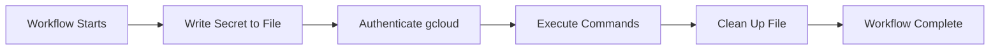

# GitHub Actions Implementation Summary

## 🎯 Overview

This document summarizes the GitHub Actions workflow implementation for database provisioning and CI/CD automation in the Loist MCP Server project.

---

## 📦 Files Created

### 1. Workflow File
- **Path:** `.github/workflows/database-provisioning.yml`
- **Purpose:** Automated database provisioning, migration, testing, and health checks
- **Status:** ✅ Created

### 2. Documentation Files
- **Path:** `docs/github-actions-setup.md`
  - **Purpose:** Comprehensive setup guide with detailed instructions
  - **Status:** ✅ Created

- **Path:** `docs/github-secrets-quick-setup.md`
  - **Purpose:** Quick 5-minute setup guide
  - **Status:** ✅ Created

- **Path:** `docs/github-actions-implementation-summary.md` (this file)
  - **Purpose:** Implementation summary and overview
  - **Status:** ✅ Created

### 3. Updated Files
- **Path:** `.gitignore`
  - **Change:** Added patterns for Google Cloud credential files
  - **Status:** ✅ Updated

- **Path:** `README.md`
  - **Change:** Added GitHub Actions CI/CD section
  - **Status:** ✅ Updated

---

## 🔧 Workflow Features

### Workflow Actions

The workflow provides four distinct actions accessible via manual dispatch:

#### 1. **Provision** (`provision`)
- **Purpose:** Create a new Cloud SQL PostgreSQL instance
- **Triggers:** Manual dispatch only
- **Key Steps:**
  1. Authenticate to Google Cloud
  2. Check if instance already exists
  3. Run provisioning script if needed
  4. Clean up credentials

#### 2. **Migrate** (`migrate`)
- **Purpose:** Run database migrations
- **Triggers:**
  - Manual dispatch
  - Automatic on push to `main` branch
- **Key Steps:**
  1. Set up Python environment
  2. Install dependencies
  3. Start Cloud SQL Proxy
  4. Run migrations via `database.migrate`
  5. Verify migration status

#### 3. **Test** (`test`)
- **Purpose:** Run database integration tests
- **Triggers:**
  - Manual dispatch
  - Automatic on pull requests modifying database files
- **Key Steps:**
  1. Set up Python and dependencies
  2. Install pytest and coverage tools
  3. Start Cloud SQL Proxy
  4. Run database tests
  5. Upload coverage reports to Codecov

#### 4. **Health Check** (`health-check`)
- **Purpose:** Verify Cloud SQL instance is healthy and accessible
- **Triggers:** Manual dispatch only
- **Key Steps:**
  1. Check instance status via gcloud
  2. Start Cloud SQL Proxy
  3. Test database connection with Python
  4. Display PostgreSQL version

### Automatic Triggers

The workflow also runs automatically in specific scenarios:

| Event | Condition | Action |
|-------|-----------|--------|
| Push to `main` | Database files changed | Run migrations |
| Push to `dev` | Database files changed | Run migrations |
| Pull Request | Database files changed | Run tests |

**Monitored Paths:**
- `database/**`
- `scripts/create-cloud-sql-instance.sh`
- `.github/workflows/database-provisioning.yml`

---

## 🔐 Security Implementation

### Required GitHub Secrets

| Secret Name | Description | Example Value |
|-------------|-------------|---------------|
| `GCLOUD_SERVICE_KEY` | Service account JSON | `{"type": "service_account",...}` |
| `DB_USER` | Database username | `music_library_user` |
| `DB_PASSWORD` | Database password | `SecureP@ssw0rd!` |

### Authentication Flow



**Key Security Features:**
1. ✅ Secrets stored in GitHub, not in code
2. ✅ Credentials written to file at runtime only
3. ✅ Credentials automatically cleaned up (even on failure)
4. ✅ Service account with minimal required permissions
5. ✅ Cloud SQL Proxy for secure connections
6. ✅ No credentials in logs or outputs

### IAM Permissions

The GitHub Actions service account requires:

- **Cloud SQL Admin** (`roles/cloudsql.admin`)
  - Create/manage instances
  - Manage databases and users
  
- **Service Account User** (`roles/iam.serviceAccountUser`)
  - Use service accounts for authentication

---

## 🚀 Usage Examples

### Initial Setup (First Time)

```bash
# 1. Create service account
gcloud iam service-accounts create github-actions \
    --display-name="GitHub Actions CI/CD" \
    --project=loist-music-library

# 2. Grant permissions
gcloud projects add-iam-policy-binding loist-music-library \
    --member="serviceAccount:github-actions@loist-music-library.iam.gserviceaccount.com" \
    --role="roles/cloudsql.admin"

# 3. Create key
gcloud iam service-accounts keys create github-actions-key.json \
    --iam-account=github-actions@loist-music-library.iam.gserviceaccount.com

# 4. Add to GitHub Secrets (via web UI)
# - GCLOUD_SERVICE_KEY: contents of github-actions-key.json
# - DB_USER: music_library_user
# - DB_PASSWORD: from .env.database

# 5. Clean up
rm github-actions-key.json
```

### Running Workflows

#### Via GitHub Web UI

1. Navigate to **Actions** tab
2. Select **Database Provisioning**
3. Click **Run workflow**
4. Choose action from dropdown
5. Click **Run workflow** button

#### Via GitHub CLI

```bash
# Provision database
gh workflow run database-provisioning.yml \
  -f action=provision

# Run migrations
gh workflow run database-provisioning.yml \
  -f action=migrate

# Run tests
gh workflow run database-provisioning.yml \
  -f action=test

# Health check
gh workflow run database-provisioning.yml \
  -f action=health-check
```

---

## 📊 Workflow Architecture

### Job Dependencies

```
provision (manual)
    └── Creates Cloud SQL instance

migrate (manual or auto)
    └── Requires existing instance
    └── Runs database migrations

test (manual or auto on PR)
    └── Requires existing instance
    └── Runs database tests
    └── Uploads coverage

health-check (manual)
    └── Checks instance status
    └── Tests connectivity
```

### Environment Variables

Configured at workflow level:

```yaml
env:
  PROJECT_ID: loist-music-library
  REGION: us-central1
  INSTANCE_NAME: loist-music-library-db
  DATABASE_NAME: music_library
```

---

## 🔍 Monitoring & Troubleshooting

### Common Issues & Solutions

#### 1. "Unable to read file []" Error

**Cause:** `GCLOUD_SERVICE_KEY` secret not configured or empty

**Solution:**
```bash
# Verify secret exists
gh secret list

# If missing, create and add service account key
gcloud iam service-accounts keys create github-actions-key.json \
    --iam-account=github-actions@loist-music-library.iam.gserviceaccount.com

# Add to GitHub via web UI or:
gh secret set GCLOUD_SERVICE_KEY < github-actions-key.json
```

#### 2. "Permission Denied" Error

**Cause:** Service account lacks required IAM roles

**Solution:**
```bash
# Grant Cloud SQL Admin role
gcloud projects add-iam-policy-binding loist-music-library \
    --member="serviceAccount:github-actions@loist-music-library.iam.gserviceaccount.com" \
    --role="roles/cloudsql.admin"
```

#### 3. Database Connection Failed

**Cause:** Incorrect `DB_USER` or `DB_PASSWORD` secrets

**Solution:**
```bash
# Retrieve correct values from local .env.database
cat .env.database | grep DB_USER
cat .env.database | grep DB_PASSWORD

# Update GitHub secrets via web UI
```

#### 4. Cloud SQL Proxy Connection Timeout

**Cause:** Instance not running or connection name incorrect

**Solution:**
```bash
# Verify instance is running
gcloud sql instances describe loist-music-library-db \
    --project=loist-music-library

# Verify connection name matches workflow env vars
```

### Workflow Logs

Access detailed logs:

1. Go to **Actions** tab
2. Click on workflow run
3. Select job (provision, migrate, test, health-check)
4. Expand steps to view detailed logs

**Log Levels:**
- ℹ️ INFO: Normal operation
- ⚠️ WARNING: Non-fatal issues
- ❌ ERROR: Fatal errors requiring intervention
- ✅ SUCCESS: Operation completed successfully

---

## 📈 Future Enhancements

### Planned Improvements

- [ ] Add workflow for database backups
- [ ] Implement automated performance testing
- [ ] Add security scanning for database configurations
- [ ] Create workflow for database user management
- [ ] Add cost monitoring and alerts
- [ ] Implement disaster recovery testing
- [ ] Add workflow for database scaling
- [ ] Create staging environment workflows

### Integration Opportunities

- [ ] Integrate with Slack for notifications
- [ ] Add PagerDuty alerts for failures
- [ ] Implement automated rollback on migration failures
- [ ] Add workflow for blue-green deployments
- [ ] Integrate with Datadog for monitoring

---

## ✅ Success Criteria

### Verification Checklist

- [x] Workflow file created and committed
- [x] Documentation created and comprehensive
- [x] README updated with CI/CD section
- [x] .gitignore updated for credential files
- [ ] GitHub Secrets configured (user action required)
- [ ] Service account created with permissions (user action required)
- [ ] Health check workflow tested successfully (pending secrets)
- [ ] Database tests passing in CI (pending secrets)

### Next Steps for User

1. **Configure GitHub Secrets** (5 minutes)
   - Follow [Quick Setup Guide](./github-secrets-quick-setup.md)

2. **Test Workflow** (2 minutes)
   - Run health-check action
   - Verify successful connection

3. **Enable Automatic Triggers** (automatic)
   - Workflows will run on PR and push events

4. **Monitor First Runs** (ongoing)
   - Check workflow logs
   - Verify migrations and tests pass

---

## 📚 Documentation Index

| Document | Purpose | Audience |
|----------|---------|----------|
| [github-actions-setup.md](./github-actions-setup.md) | Detailed setup guide | Administrators |
| [github-secrets-quick-setup.md](./github-secrets-quick-setup.md) | Quick 5-min setup | Developers |
| [github-actions-implementation-summary.md](./github-actions-implementation-summary.md) | Implementation overview | Project managers |
| [README.md](../README.md) | Main project documentation | All users |

---

## 🎉 Implementation Complete

The GitHub Actions workflow for database provisioning has been successfully implemented and is ready for use once GitHub Secrets are configured.

**Status:** ✅ Complete (pending user configuration of secrets)

**Last Updated:** 2025-10-10

**Implemented By:** AI Assistant (Cursor)

---

## 📞 Support

For issues or questions:
1. Check [Troubleshooting](#monitoring--troubleshooting) section
2. Review [GitHub Actions Setup Guide](./github-actions-setup.md)
3. Open an issue on the project repository


