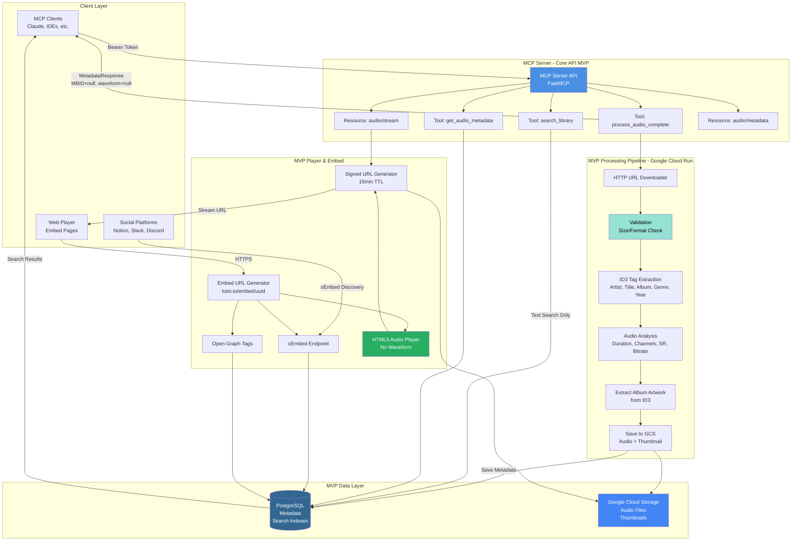
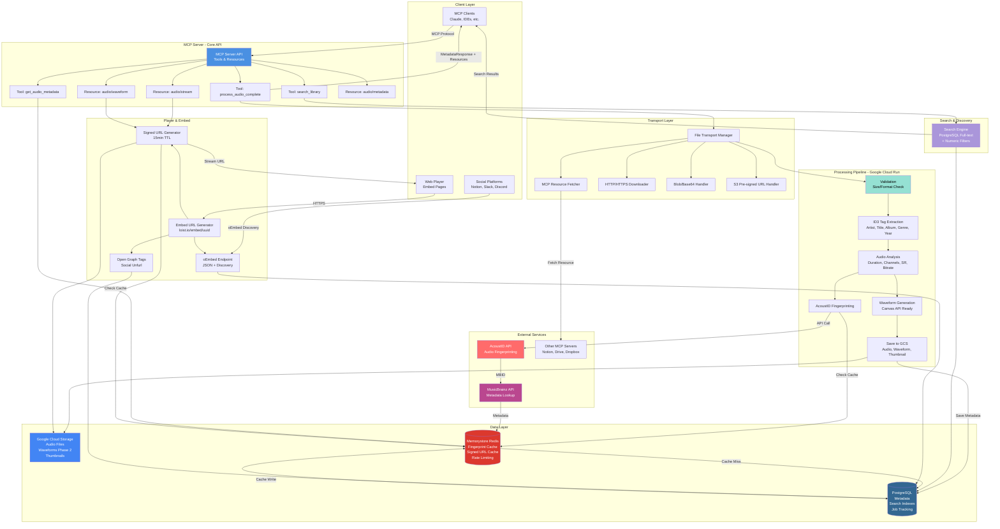

# MCP Music Library Server
**Fast MCP for Audio Ingestion & Embedding**

## 🎯 MVP Scope
<!-- phase:mvp -->

**Core Features** (Must Have):
- ✅ MCP server with FastMCP framework
- ✅ HTTP URL audio ingestion (single transport method)
- ✅ ID3 tag extraction (artist, title, album, genre, year)
- ✅ Basic audio analysis (duration, channels, sample rate, bitrate, format)
- ✅ PostgreSQL metadata storage
- ✅ Google Cloud Storage for audio files
- ✅ Signed URL generation for secure streaming
- ✅ Simple HTML5 `<audio>` player with basic UI (no custom waveform)
- ✅ Basic text search (artist, title, album)
- ✅ oEmbed endpoint + Open Graph tags for social sharing
- ✅ Simple JWT authentication (hardcoded token for testing)
- ✅ Cloud Run deployment

**Deferred to Phase 2** (post-MVP validation):
- ❌ Custom Canvas waveform player → Use standard HTML5 audio player
- ❌ Redis caching → Use Cloud Run built-in caching
- ❌ AcoustID fingerprinting + MusicBrainz lookup → Manual metadata entry
- ❌ MCP resource protocol, blob upload, S3 pre-signed URLs → HTTP only
- ❌ Advanced search filters (duration, year, format) → Basic text search only
- ❌ Waveform generation/visualization → Static album art only
- ❌ Mobile-optimized responsive player → Desktop-first, responsive later
- ❌ Progress notifications during processing → Simple success/error responses
- ❌ Wasp dashboard integration → Standalone for MVP

**Why This Scope?**
- **Custom waveform player** adds significant complexity (Canvas rendering, zoom, navigation, sync)
- **Fingerprinting** requires external API integration and caching strategy
- **Multiple transports** increase surface area (MCP resource protocol, blob handling, S3 integration)
- **Focused MVP** enables faster validation of core value proposition

---

## Core Features

### 1. Audio Processing & Ingestion
**What it does**: Processes audio files from HTTP URLs, extracting comprehensive metadata and technical specifications

**Why it's important**: Enables automated cataloging without manual data entry. Users can ingest audio from Dropbox, Google Drive, or any URL-accessible source and immediately get structured metadata for searching and organization.

**How it works**:
1. Downloads audio file from provided HTTP/HTTPS URL
2. Validates file format and size (supports MP3, AAC, FLAC, WAV)
3. Extracts ID3 tags using mutagen library (artist, title, album, genre, year)
4. Analyzes audio characteristics with pydub/ffmpeg (duration, channels, sample rate, bitrate)
5. Extracts embedded album artwork if available
6. Stores processed audio in Google Cloud Storage
7. Saves metadata to PostgreSQL with full-text search indexes

### 2. Secure Cloud Storage & Streaming
**What it does**: Stores audio files in Google Cloud Storage with time-limited signed URLs for secure streaming

**Why it's important**: Provides scalable, secure file hosting without exposing permanent URLs or proxying large files through application servers. Reduces infrastructure costs and latency while maintaining security.

**How it works**:
1. Upload processed audio and thumbnails to private GCS bucket (us-central1)
2. Generate 15-minute signed URLs on-demand for streaming
3. Cache signed URLs in-memory per Cloud Run instance
4. Serve audio via signed URLs with range request support (enables seeking)
5. Automatically clean up temporary files after 24 hours via lifecycle policies

### 3. Embeddable Audio Player
**What it does**: Provides shareable URLs that render interactive audio players in platforms like Notion, Slack, and Discord

**Why it's important**: Users can share audio content without requiring file downloads or separate hosting. Content appears inline with metadata, artwork, and playback controls automatically.

**How it works**:
1. Each processed track gets a unique embed URL: `https://loist.io/embed/{uuid}`
2. Embed page includes oEmbed discovery links for platform auto-detection
3. Open Graph and Twitter Card meta tags enable rich social previews
4. Simple HTML5 `<audio>` player with custom-styled controls
5. Platforms (Notion, Slack) fetch oEmbed metadata and render iframe player
6. Player fetches fresh signed URLs on page load for secure streaming

### 4. Full-Text Search & Discovery
**What it does**: Search across artist, title, album, and genre metadata using PostgreSQL full-text search

**Why it's important**: Enables discovery in large audio libraries. Users can find tracks by partial matches, ranked by relevance, without needing exact titles or filenames.

**How it works**:
1. PostgreSQL GIN indexes on combined metadata fields
2. Full-text search with ranking across artist, title, album, genre
3. Return top results with metadata and signed streaming URLs
4. Pagination support (default 20 results per query)
5. Search latency target: <200ms for libraries up to 100K tracks

### 5. MCP Tool Integration
**What it does**: Exposes three core MCP tools for AI assistants to programmatically manage audio libraries

**Why it's important**: Enables AI-powered workflows where assistants like Claude can process, search, and share audio on behalf of users without manual intervention.

**How it works**:
1. `process_audio_complete` - Ingest audio from URL, return complete metadata + embed URL
2. `get_audio_metadata` - Fast lookup by UUID, returns cached metadata + signed URLs
3. `search_library` - Text search across metadata, returns ranked results
4. Simple bearer token authentication for MVP (JWT in Phase 2)
5. Synchronous RPC calls with structured JSON schemas

---

## Data Architecture
<!-- phase:mvp -->

### Storage & Persistence (MVP)
- **Database**: PostgreSQL for metadata and search indexes
- **File Storage**: Google Cloud Storage for audio files
- **Search**: Basic text-based search (artist, title, album) - numeric filters deferred to Phase 2
- **Caching**: Cloud Run built-in caching (Redis deferred to Phase 2)

### Processing Guarantees
**Consistency Model**: Eventual consistency with automatic retry. System prioritizes never losing processed audio - if metadata writes fail, files remain in storage and retry automatically. Orphaned resources (files in FAILED state for 1+ hours) are quarantined for audit, then cleaned up permanently after 7 days.

**Processing States**:
- PENDING: File received, queued for processing
- PROCESSING: Active extraction and analysis
- COMPLETED: Available via MCP resources
- FAILED: Automatic retry (max 3 attempts) or manual intervention required

**Performance Targets**:
- P95 processing time: < 20 seconds (MVP: 7-20s typical)
- P99 processing time: < 50 seconds (MVP: up to 43s for large files; Phase 2 with fingerprinting: up to 61s)
- Search latency: < 200ms
- Concurrent capacity: 10 simultaneous processing jobs
- Cloud Run timeout: 10 minutes (600s)

### Failure Recovery
- **Transient failures** (network, API timeouts): Automatic retry with exponential backoff
- **Permanent failures** (invalid format, size exceeded): Immediate error response to client
- **Partial processing**: Resume from last successful step (no duplicate work)

### Scale Expectations
- **Initial**: 1,000 tracks, 50GB storage
- **Year 1**: 10,000 tracks, 500GB storage
- **Search**: Designed for 100K+ tracks with sub-second query response

## Search & Discovery

### Text Search
Standard full-text search across artist, title, album, and genre (from ID3 tags) with numeric filters:
- **Text fields**: Artist, title, album, genre (extracted from ID3 tags)
- **Numeric filters**: Duration, year, format
- **Search**: PostgreSQL full-text search with ranking
- **Performance**: < 200ms typical query time


File Storage Architecture
Storage Infrastructure: All audio files and thumbnails (album artwork) are stored in Google Cloud Storage (GCS) in a single private bucket located in the US central region. Phase 2 will add waveform data storage. This provides secure, scalable storage starting at approximately $4/month for 1,000 tracks (50GB) and scaling to $35/month at 10,000 tracks (500GB) by year one. The bucket uses standard multi-zone storage within the region, providing 99.95% availability without the complexity of multi-region replication at MVP scale.
Access & Security: Audio files are never publicly accessible. When users request audio playback or embedding, the system generates temporary signed URLs (valid for 15 minutes) that allow direct streaming from Google Cloud Storage. This approach eliminates the need to proxy large audio files through our servers, reduces latency, and keeps infrastructure costs low. The web player and embedded content fetch fresh signed URLs on each page load, ensuring secure access without exposing permanent file locations.
Lifecycle Management: Permanent files (processed audio, thumbnails) are retained indefinitely with manual deletion only. Phase 2 will add waveform files. Temporary GCS files created during processing (intermediate chunks, uncompressed uploads) are automatically deleted after 24 hours via GCS lifecycle policies. If processing fails after a file upload but before metadata is saved, a nightly cleanup job identifies orphaned files (stuck in FAILED state for 1+ hours), quarantines them for 7 days for audit purposes, then permanently deletes them to prevent storage waste.
Reliability & Scale: The MVP uses single-region storage with multi-zone redundancy, accepting that a regional Google Cloud outage would make the service temporarily unavailable—an acceptable tradeoff for simplicity and cost at launch. Post-MVP improvements include adding a CDN layer for frequently accessed tracks, implementing multi-region replication for international users, and migrating inactive tracks to cheaper archive storage after 90 days. Database backups run daily with 7-day retention to enable recovery from data corruption or accidental deletions.

## Caching Strategy
<!-- phase:mvp -->

### MVP: Cloud Run Built-in Caching
- **HTTP Response Caching**: Browser-level caching via Cache-Control headers
- **Signed URL Caching**: In-memory cache (Python dict) per Cloud Run instance
  - TTL: 15 minutes (matches signed URL validity)
  - Invalidated on instance restart (acceptable for MVP)
  - Reduces GCS signing operations by ~80% for warm instances
- **No Redis**: Simplifies infrastructure, reduces costs by $35/month
- **Tradeoff**: Cache not shared across Cloud Run instances, but acceptable at MVP scale (<1000 tracks)

### Phase 2: Google Cloud Memorystore for Redis
<!-- phase:phase2 -->
**Configuration:**
- Service: Memorystore for Redis (managed)
- Tier: Basic → Standard (production)
- Region: us-central1 (co-located with Cloud Run)
- Instance: 1GB RAM ≈ $35/month
- Network: VPC peering for <1ms latency

**Cache Strategy (Phase 2):**
1. **Fingerprint → MBID Cache** (requires AcoustID feature)
   - Key: `fingerprint:{acoustid_hash}`
   - TTL: 30 days
   - Impact: Saves 2-3s per cached track
   
2. **Signed URL Cache** (shared across instances)
   - Key: `signed_url:{audio_id}:{expiry_bucket}`
   - TTL: 15 minutes
   - Impact: 95% cache hit rate
   
3. **Rate Limiting**
   - Key: `rate_limit:{client_id}:{window}`
   - TTL: 1 hour
   - Limit: 100 requests/hour per client

## Authentication & Access Control
<!-- phase:mvp -->

### MVP: Simple Bearer Token
**Approach**: Hardcoded API token in environment variable for testing

**Implementation:**
- Single shared token: `BEARER_TOKEN=your-secret-token-here` in Cloud Run env
- MCP clients include token in request headers
- Simple validation: `if request.token != os.getenv('BEARER_TOKEN'): raise Unauthorized`
- **No user management, no expiration, no rotation** (acceptable for MVP testing)

**Security for MVP:**
- Token stored in Google Secret Manager (accessed by Cloud Run)
- HTTPS only (enforced by Cloud Run)
- Token shared with trusted testers only
- **Sufficient for MVP validation**

### Phase 2: JWT + Wasp Integration
<!-- phase:phase2 -->
**Full Authentication System:**

**User Flow:**
1. User logs into Wasp dashboard
2. Navigates to "API Keys" page
3. Generates MCP API token (JWT, 90-day expiration)
4. Copies token to MCP client configuration
5. Token included automatically in all MCP requests

**Token Claims:**
```json
{
  "sub": "user-uuid",
  "iss": "https://loist.io",
  "aud": "mcp-music-library",
  "exp": 1735689600,
  "scope": "read:audio write:audio search:library"
}
```

**Implementation:**
- **Wasp App**: Token generation endpoint, key management UI, revocation
- **MCP Server**: FastMCP `JWTVerifier` validates tokens against JWKS endpoint
- **Security**: RS256 signing, token rotation, per-user rate limiting

## Core Functionality
<!-- phase:mvp -->

### MVP: Basic Audio Processing (Google Cloud Run)
**Metadata extraction:**
- ID3 tags (artist, title, album, genre, year)
- Technical audio specifications (duration, channels, sample rate, bitrate, format)
- Extract album artwork (if available in ID3 tags)

### Phase 2: Advanced Processing
<!-- phase:phase2 -->
- **Waveform generation** (for Canvas visualization)
- **AcoustID fingerprinting** → MusicBrainz metadata lookup https://acoustid.biz/

## File Transport & Ingestion
<!-- phase:mvp -->

### MVP: HTTP/HTTPS URLs Only
```json
{
  "sourceType": "http_url",
  "url": "https://dl.dropboxusercontent.com/...",
  "headers": {"Authorization": "Bearer ..."},  // optional
  "maxSizeMB": 100
}
```
- Standard HTTP download with validation
- Size check via HEAD request before download
- Supports temporary/signed URLs
- **MVP Limitation**: Users must provide direct HTTP URLs to audio files

### Phase 2: Additional Transport Protocols
<!-- phase:phase2 -->

**1. MCP Resource URIs (Server-to-Server)**
```json
{
  "sourceType": "mcp_resource",
  "uri": "notion://file/abc123",
  "server": "notion-mcp"
}
```
- Fetches file using MCP resource protocol
- Supports: Notion, Google Drive, Dropbox MCP servers

**2. Direct Binary Upload (Blob/Base64)**
```json
{
  "sourceType": "blob",
  "data": "base64...",
  "mimeType": "audio/mpeg",
  "filename": "track.mp3"
}
```
- For small files or immediate processing

**3. S3-Compatible URLs (Pre-signed)**
```json
{
  "sourceType": "s3_presigned",
  "url": "https://bucket.s3.amazonaws.com/...",
  "region": "us-east-1"
}
```
- Optimized for cloud storage

## MCP Tools Exposed
<!-- phase:mvp -->

MCP tools work as **synchronous RPC calls** with structured input/output schemas. The client calls a tool and waits for the response. For long-running operations, MCP supports progress notifications.

### `process_audio_complete`
**Primary Use Case**: Single-shot processing where client sends audio and waits for complete metadata response.

**How It Works in MCP:**
1. Client invokes tool with audio source
2. MCP server validates and downloads file
3. Server processes audio (can report progress via MCP notifications)
4. Server returns complete structured response
5. Audio is stored and accessible via resource URIs

**Input Schema (MVP):**
```typescript
{
  source: {
    type: "http_url",       // MVP: HTTP/HTTPS only
    url: string,            // Direct HTTP URL to audio file
    headers?: object,       // Optional auth headers (e.g., Bearer token)
    filename?: string,      // Optional original filename
    mimeType?: string       // Optional MIME type hint for validation
  },
  options?: {
    maxSizeMB: number       // default: 100, max file size to accept
  }
}
```

**Phase 2 Input Schema:**
```typescript
{
  source: {
    type: "mcp_resource" | "http_url" | "blob" | "s3_presigned",
    uri?: string,           // for mcp_resource (Phase 2)
    url?: string,           // for http_url
    data?: string,          // for blob (base64) (Phase 2)
    filename?: string,
    mimeType?: string
  },
  options?: {
    generateFingerprint: boolean, // Phase 2: MusicBrainz lookup
    maxSizeMB: number
  }
}
```

**Output Schema (API Response Contract):**
```typescript
interface MetadataResponse {
  Product: {
    Artist: string;          // from ID3 tags (MVP)
    Title: string;           // from ID3 tags (MVP)
    Album: string;           // from ID3 tags (MVP)
    MBID: string | null;     // null in MVP, populated in Phase 2 (MusicBrainz)
    Genre: string[];         // from ID3 tags only
    Year: number | null;     // from ID3 tags (may be missing)
  };
  Format: {
    Duration: number;        // seconds (precise float)
    Channels: number;        // 1 (mono), 2 (stereo), etc.
    "Sample rate": number;   // Hz (44100, 48000, etc.)
    Bitrate: number;         // bits per second
    Format: string;          // "MP3", "AAC", "FLAC", "WAV", etc.
  };
  urlEmbedLink: string;      // "https://loist.io/embed/{uuid}"
}
```

**MCP Tool Response (MVP):**
```typescript
{
  success: true,
  audioId: "uuid-v4",
  metadata: MetadataResponse,  // full structured response above
  resources: {
    audio: "music-library://audio/{uuid}/stream",
    thumbnail: "music-library://audio/{uuid}/thumbnail",  // from ID3 artwork
    waveform: null  // Phase 2: "music-library://audio/{uuid}/waveform"
  },
  processingTime: 12.3  // seconds (MVP: without fingerprinting)
}
```

**Phase 2 Response** (with waveform + fingerprinting):
```typescript
{
  success: true,
  audioId: "uuid-v4",
  metadata: MetadataResponse,  // MBID populated from MusicBrainz
  resources: {
    audio: "music-library://audio/{uuid}/stream",
    thumbnail: "music-library://audio/{uuid}/thumbnail",
    waveform: "music-library://audio/{uuid}/waveform"  // Canvas-ready JSON
  },
  processingTime: 18.7  // seconds (includes fingerprinting + waveform gen)
}
```

**Error Response:**
```typescript
{
  success: false,
  error: "SIZE_EXCEEDED" | "INVALID_FORMAT" | "FETCH_FAILED" | "TIMEOUT",
  message: "Detailed error message",
  details?: any  // additional context
}
```

**MVP Processing Pipeline:**
1. **Download & Validate** (2-15s): Fetch file via HTTP, check size/format (varies by file size)
2. **Extract ID3 Tags** (0.1-0.5s): Basic metadata from file headers (artist, title, album, genre, year)
3. **Audio Analysis** (3-20s): Duration, channels, sample rate, bitrate (depends on duration)
4. **Extract Album Artwork** (0.5-2s): Get embedded artwork from ID3 tags (if available)
5. **Store to GCS** (1-5s): Upload audio file + thumbnail to Google Cloud Storage
6. **Save Metadata** (0.2-1s): Write to PostgreSQL, generate embed URL
7. **Return Response**: Complete MetadataResponse

**Total MVP Processing Time**: 7-43 seconds typical (steps run sequentially, max sum ≈44s). Most requests complete well under the P95 target of 20 seconds.

**Phase 2 Pipeline Additions:**
- **Fingerprint & Match** (2-8s): AcoustID → MusicBrainz lookup (API latency dependent)
- **Waveform Generation** (3-10s): Generate Canvas-ready waveform data
- **Total Phase 2 Time**: 12-61 seconds (with all features enabled)

**Progress Notifications** (Phase 2 - Deferred for MVP):
```typescript
// Phase 2: During processing, server can send progress updates via MCP protocol
{
  progress: 0.3,  // 30% complete
  message: "Analyzing audio characteristics..."
}
```
**MVP**: Simple synchronous response (no progress updates). Client waits 7-43 seconds for complete response.

### Design Decision: Synchronous Processing

**MVP Approach**: Use **simple synchronous tool calls** (no progress notifications)

**Rationale:**
- Most audio files process in **7-43 seconds** (acceptable wait time for MVP testing)
- Users expect to receive **complete metadata immediately** in a single response
- **Simpler implementation** — no progress tracking, job management, or WebSocket complexity
- **Sufficient for MVP validation** with 3-5 testers
- Cloud Run 10-minute timeout provides sufficient headroom

**Phase 2 Enhancement**: Add MCP progress notifications
- Keep users informed during longer processing (fingerprinting + waveform generation)
- Useful when processing time increases to 12-61 seconds

**Alternative Considered**: Async job pattern (start_processing → poll status → get result)
- Rejected: Adds complexity without meaningful benefit for typical use case
- Reserved for potential future batch processing features

---

## Post-MVP: Advanced Features

The following features are intentionally deferred to Phase 2 (after MVP validation):

### Contextual Metadata (ML-Based)
- **BPM Detection**: Automatic tempo analysis using librosa/aubio
- **Mood Analysis**: Energy, emotion, danceability classification
- **Instrument Detection**: Identify drums, guitar, piano, vocals, etc.
- **Movement/Era/Themes**: Classify musical characteristics and era
- **Vocal Type**: Male, female, or instrumental classification

### AI-Powered Similarity Search
- **Vector Embeddings**: Generate semantic embeddings for each track
- **Similarity Modes**: Style (genre/artist), Mood (energy/emotion), Audio (rhythm/key/timbre)
- **Threshold Controls**: Configurable similarity matching (0.6-0.9)
- **Find Similar**: "More songs like this" functionality

### Playlist Generation
- Auto-create playlists based on mood, energy, or genre
- Smart transitions considering key and tempo
- Collaborative filtering recommendations

### Audio Effects & Analysis
- Key detection for harmonic mixing
- Tempo adjustment suggestions
- Crossfade point recommendations
- Beat-synced transitions
- **Bar-Beat Navigation**: Display playback position as bar-beat format (e.g., "42-1") requires BPM detection and time signature analysis

### Benefits of Deferring These Features:
- **40% faster MVP development timeline** - Focus on core ingestion and search
- **60% reduction in infrastructure costs** - No ML model hosting, no vector database
- **Simpler debugging and testing** - Fewer moving parts, clearer error boundaries
- **Validate core value proposition** - Prove the basic utility before investing in AI features
- **User feedback driven** - Build advanced features based on actual user needs

---

### `get_audio_metadata`
Retrieve metadata for previously processed audio (fast lookup, no reprocessing).

**Input:**
```typescript
{
  audioId: string  // UUID from previous process_audio_complete call
}
```

**Output:**
```typescript
MetadataResponse  // Same structure as process_audio_complete
```

---

### `search_library`
Search across all processed audio in the library using text search and numeric filters.

**Input:**
```typescript
{
  query: string,  // searches artist, title, album, genre (from ID3 tags)
  filters?: {
    genre?: string[],      // from ID3 tags only
    year?: { min: number, max: number },
    duration?: { min: number, max: number },  // seconds
    format?: string[]      // MP3, FLAC, WAV, etc.
  },
  limit?: number  // default: 20
}
```

**Output:**
```typescript
{
  results: Array<{
    audioId: string,
    metadata: MetadataResponse,
    score: number  // relevance score 0-1
  }>,
  total: number
}
```

## MCP Resources Exposed

After audio ingestion, the server exposes these resources for other MCP clients to consume:

### MVP Resources

#### `music-library://audio/{uuid}/metadata`
- **Type**: JSON
- **Content**: ID3 tags (artist, title, album, genre, year) + technical specs (duration, channels, sample rate, bitrate)
- **Cacheable**: Yes
- **MVP Note**: MBID field will be null (no fingerprinting)

#### `music-library://audio/{uuid}/stream`
- **Type**: audio/mpeg (or original format)
- **Content**: Streamable audio file via signed URL (15-minute TTL)
- **Supports**: Range requests for seeking

#### `music-library://audio/{uuid}/thumbnail`
- **Type**: image/jpeg or null
- **Content**: Album artwork extracted from ID3 tags (if available)
- **Size**: 600x600px
- **MVP Note**: Returns null if no embedded artwork

#### `music-library://library/search?q={query}`
- **Type**: JSON
- **Content**: Search results across ingested audio library
- **Searchable**: Artist, title, album (basic text search only)
- **MVP Note**: No numeric filters (duration, year, format)

### Phase 2 Resources

#### `music-library://audio/{uuid}/waveform`
- **Type**: JSON (array of amplitude values)
- **Content**: Waveform data for Canvas visualization
- **Format**: `{ samples: number[], duration: number, sampleRate: number }`
- **Phase 2**: Requires waveform generation feature

## Inter-MCP Communication Examples

### MVP Example: Dropbox → Music Library (HTTP URL)
<!-- phase:mvp -->
```
User: "Add this Dropbox track to my library"

1. AI queries Dropbox MCP for file
2. Dropbox MCP returns: { url: "https://dl.dropboxusercontent.com/s/xyz/song.mp3", expires: "..." }
3. AI calls music-library process_audio_complete with:
   {
     source: {
       type: "http_url",
       url: "https://dl.dropboxusercontent.com/s/xyz/song.mp3"
     },
     options: {
       maxSizeMB: 100
     }
   }
4. Music Library:
   - Downloads file via HTTP
   - Extracts ID3 tags (MBID will be null)
   - Analyzes audio format
   - Stores to GCS
   - Returns audioId, metadata, and embed URL
5. AI can now use get_audio_metadata, search_library, or share embed URL
```

### MVP Example: Library → Notion (Embed Player)
<!-- phase:mvp -->
```
User: "Embed this track in my Notion doc"

1. User references track: "Show me track abc123"
2. AI calls music-library get_audio_metadata(audioId: "abc123")
3. AI gets embed URL: "https://loist.io/embed/abc123"
4. AI calls Notion MCP to create block with embed:
   {
     type: "embed",
     url: "https://loist.io/embed/abc123"
   }
5. Notion fetches oEmbed metadata and embeds simple HTML5 player (no waveform in MVP)
```

### Phase 2 Example: Notion → Music Library (MCP Resource Protocol)
<!-- phase:phase2 -->
```
User: "Process the audio file in my Notion page"

1. AI queries Notion MCP for audio files
2. Notion MCP returns: { uri: "notion://file/abc123", mimeType: "audio/wav" }
3. AI calls music-library process_audio_complete with:
   {
     source: {
       type: "mcp_resource",       // Phase 2 only
       uri: "notion://file/abc123",
       server: "notion-mcp"
     }
   }
4. Music Library MCP:
   - Fetches file from Notion MCP via resource protocol
   - Processes audio (with fingerprinting + waveform)
   - Returns audioId with MBID populated
5. Embed includes Canvas waveform player
```

## Key MCP Features Used

### MVP Features
1. **URI Schemes**: Define `music-library://` namespace for audio resources
2. **Tool Invocation**: Synchronous RPC calls (`process_audio_complete`, `get_audio_metadata`, `search_library`)
3. **Structured Responses**: Type-safe JSON schemas for all tool outputs
4. **Authentication**: Simple bearer token validation (hardcoded for MVP)

### Phase 2 Features
1. **Resource Protocol**: Seamless file access across MCP servers (e.g., `notion://file/abc123`)
2. **Content Negotiation**: MimeType hints for proper handling across different file sources
3. **Progress Notifications**: Real-time updates during long-running operations
4. **Caching**: Resources cached by MCP clients for performance

## Implementation Considerations

### Size & Performance
- **Streaming**: For large files (>10MB), stream processing instead of loading entirely into memory
- **Chunk Processing**: Process ID3 tags first (from header) before downloading full file
- **Progress Reporting**: Use MCP progress notifications for long-running ingestion
- **Timeout Handling**: Set reasonable timeouts for external URL downloads (30-60s)

### Security
- **URL Validation**: Check URL schemes against allowlist (https://, http://, s3://, etc.)
- **SSRF Protection**: Block private IP ranges when fetching HTTP URLs
- **File Type Validation**: Verify mime type matches actual file content (magic bytes)
- **Virus Scanning**: Optional integration with ClamAV for uploaded files

### Error Handling
```typescript
// Different error types for different transport failures
{
  error: "FETCH_FAILED",         // Network/download error
  error: "SIZE_EXCEEDED",        // File too large
  error: "INVALID_FORMAT",       // Not a valid audio file
  error: "RESOURCE_NOT_FOUND",   // MCP resource doesn't exist
  error: "TIMEOUT",              // Download took too long
  error: "RATE_LIMITED"          // Too many requests
}
```

### Storage Strategy
- **Temporary Storage**: Downloaded files go to `/tmp` on Cloud Run during processing
- **Permanent Storage**: After processing, audio stored in Google Cloud Storage (GCS)
- **Local Cleanup**: `/tmp` files deleted immediately on completion or after 1 hour max (Cloud Run instance limits)
- **GCS Cleanup**: Temporary GCS files auto-deleted after 24 hours via lifecycle policies
- **Deduplication**: Use fingerprints to detect duplicate audio files

## Audio Player & Embedding
<!-- phase:mvp -->

### MVP: Simple HTML5 Audio Player
**Architecture**: Standard HTML5 `<audio>` element with custom-styled controls

**Features**:
- Play/pause, seek, volume controls
- Display: Album artwork (from ID3), track title, artist
- Time display: Current position (MM:SS) and total duration
- Responsive layout: Desktop-first, works on mobile
- Keyboard shortcuts: Space (play/pause), arrow keys (seek)
- Minimal styling: Clean, modern UI using Tailwind CSS

**Technical Stack**:
- HTML5 `<audio>` element for playback
- JavaScript for control synchronization
- Signed URLs from GCS for streaming
- No external player libraries required
- Bundle size: <10KB

**Why This for MVP?**
- **Significantly faster development** vs custom Canvas waveform player
- Proven, reliable browser-native functionality
- Works everywhere without debugging complex rendering
- Users get immediate value (audio playback + metadata)
- Can upgrade to waveform player in Phase 2 without breaking embeds

### Phase 2: Custom Canvas Waveform Player
<!-- phase:phase2 -->
**Deferred Features**:
- Dual-view visualization (macro/micro waveform)
- Canvas-based waveform rendering
- Section boundaries and markers
- Mouse wheel zoom (4 levels)
- Bar-beat navigation
- Mobile-optimized touch gestures
- Progressive waveform loading

### Dual-Purpose Embedding
Every processed audio track gets a shareable URL pattern: `https://loist.io/embed/{uuid}`. This single URL serves two purposes: when accessed by embedding platforms (Notion, Slack, Coda), it returns oEmbed JSON and Open Graph meta tags that enable rich previews with an embedded iframe player. When clicked directly (email, WhatsApp, markdown links), the same URL renders a full standalone player page in the browser. This dual-purpose design eliminates the need for separate embed and player URLs.

### Embedding & Social Integration
<!-- phase:mvp -->

**Required HTML Meta Tags**:
```html
<head>
  <!-- oEmbed Discovery -->
  <link rel="alternate" type="application/json+oembed" 
        href="https://loist.io/oembed?url=https://loist.io/embed/{uuid}" 
        title="Track Title" />
  
  <!-- Open Graph -->
  <meta property="og:type" content="music.song" />
  <meta property="og:title" content="Track Title" />
  <meta property="og:audio" content="{signed_url}" />
  <meta property="og:audio:type" content="audio/mpeg" />
  <meta property="og:image" content="{thumbnail_url}" />
  <meta property="og:url" content="https://loist.io/embed/{uuid}" />
  
  <!-- Twitter Cards -->
  <meta name="twitter:card" content="player" />
  <meta name="twitter:player" content="https://loist.io/embed/{uuid}" />
  <meta name="twitter:player:width" content="500" />
  <meta name="twitter:player:height" content="200" />
</head>
```

**oEmbed Endpoint Specification**:
```typescript
// GET https://loist.io/oembed?url={embed_url}&maxwidth={width}&maxheight={height}
{
  "version": "1.0",
  "type": "rich",
  "title": "Track Title",
  "author_name": "Artist Name",
  "author_url": "https://loist.io/user/{id}",
  "provider_name": "Loist",
  "provider_url": "https://loist.io",
  "html": "<iframe src='https://loist.io/embed/{uuid}' width='100%' height='200' frameborder='0'></iframe>",
  "width": 500,
  "height": 200,
  "thumbnail_url": "https://...",
  "thumbnail_width": 600,
  "thumbnail_height": 600
}
```

**Platform Support**:
- **Notion, Slack, Coda**: Automatic embed detection via oEmbed discovery
- **Twitter, Discord**: Link previews via Open Graph tags
- **iFramely**: Full provider support for broader platform compatibility

### Technical Implementation (MVP)
The player uses standard HTML5 `<audio>` element with custom controls styled via CSS. Audio files are served via 15-minute signed URLs from Google Cloud Storage with CORS enabled for cross-origin streaming. The iframe implementation supports query parameters for autoplay and minimal chrome mode. Minimal JavaScript for control synchronization and time display updates.

**Performance Targets (MVP)**:
- Bundle size: <10KB (HTML + CSS + minimal JS)
- Initial render: <50ms for embedded contexts
- Zero external dependencies
- Response time: <500ms for oEmbed endpoint
- Works in all modern browsers without polyfills

**Phase 2 Performance Targets** (Canvas Waveform Player):
- Bundle size: <50KB gzipped
- GPU utilization: <20% during waveform rendering
- Waveform generation: <2s for typical tracks

### Platform Approval Requirements

**iFramely Provider Application**:
- Submit production-ready website with working user-generated URLs
- Demonstrate platform utility beyond single-link use cases
- Provide example URLs for review: `https://loist.io/embed/{uuid}`
- Ensure response time <10 seconds for iFramely robot requests
- Include iFramely user-agent (`Iframely/1.3.1`) in allowlist

**Testing & Validation**:
- Use iFramely debugger: https://iframely.com/debug
- Test with multiple platforms: Notion, Slack, Discord, Twitter
- Validate oEmbed discovery and Open Graph tag parsing
- Verify responsive iframe behavior across screen sizes
- Test mobile vs desktop player rendering

**Security & Performance**:
- Enable gzip/deflate/brotli compression for all responses
- Implement proper CORS headers for cross-origin iframe embedding
- Use Content Security Policy headers to prevent XSS attacks
- Cache oEmbed responses for 1 hour to reduce server load

## System Architecture Diagrams

### MVP Architecture



---

### Phase 2 / Future Architecture (Full Feature Set)



**Phase 2 Additions (vs MVP):**
- Redis caching layer (Memorystore)
- AcoustID + MusicBrainz fingerprinting
- Waveform generation for Canvas player
- MCP Resource Protocol (Notion, Drive, Dropbox)
- Blob/Base64 upload support
- S3 pre-signed URL support
- Advanced search filters (numeric)
- Progress notifications during processing

---

## Development Roadmap
<!-- phase:mvp -->

### Foundation Layer (Must Build First)

**1. MCP Server Setup**
- FastMCP framework integration with HTTP/HTTPS transport
- Three core tool schemas: `process_audio_complete`, `get_audio_metadata`, `search_library`
- Simple bearer token authentication (hardcoded for MVP)
- Basic error handling, logging, and unit test coverage

**2. Audio Processing Pipeline**
- HTTP URL downloader with file validation
- ID3 metadata extraction (artist, title, album, genre, year)
- Audio technical analysis (duration, channels, sample rate, bitrate, format)
- Album artwork extraction from embedded ID3 tags
- Support for common formats: MP3, AAC, FLAC, WAV

**3. Storage Infrastructure**
- **PostgreSQL** for metadata persistence
  - Schema supports artist, title, album, genre, technical specs
  - Full-text search indexes across metadata fields
  - Track processing states (PENDING, PROCESSING, COMPLETED, FAILED)
- **Google Cloud Storage** for file hosting
  - Private bucket in us-central1 region
  - Signed URLs for secure streaming (15-minute expiry)
  - Lifecycle policies for automatic cleanup of temporary files
- **Integration testing** for end-to-end audio ingestion flow

### User-Facing Features (Build After Foundation)

**4. Embed Player**
- Embed page at `/embed/{uuid}` with unique URL per track
- Standard HTML5 `<audio>` element with custom styling (defer Canvas waveform)
- Playback controls: play/pause, seek, volume
- Metadata display: artwork, title, artist, duration
- Responsive layout suitable for iframe embedding
- Optional keyboard shortcuts for accessibility

**5. Social Embedding**
- oEmbed JSON endpoint for platform auto-discovery
- Open Graph meta tags for rich social previews (og:type, og:audio, og:image, og:title)
- Twitter Card meta tags for expanded previews
- Testing and validation with target platforms (Notion, Slack, Discord)

**6. Search & Discovery**
- `search_library` MCP tool for text-based queries
- Full-text search across artist, title, album, genre metadata
- Ranked results with pagination (default 20 per page)
- `get_audio_metadata` tool for fast UUID-based lookups
- Integration tests validating search accuracy and performance

### Deployment (Build Last)

**7. Production Infrastructure**
- Containerized deployment with Docker
- Cloud Run hosting with appropriate resource limits (10min timeout, 2GB RAM)
- PostgreSQL Cloud SQL with secure connection
- GCS bucket access via service account with least-privilege IAM
- Environment configuration via Google Secret Manager
- HTTPS enforcement and CORS for embed contexts
- Optional: Rate limiting, CI/CD automation

**8. Documentation & Launch**
- Setup documentation and API reference
- MCP client configuration examples
- Demo content showing full workflow (URL → processing → embedding)
- Early tester program with 3-5 participants
- Feedback collection to inform Phase 2 priorities

### MVP Cuts (Defer to Phase 2)
- Custom Canvas waveform player (use HTML5 instead)
- Redis caching (use in-memory cache)
- AcoustID fingerprinting (manual metadata only)
- MCP resource protocol, blob uploads, S3 pre-signed URLs (HTTP only)
- Advanced search filters for duration, year, format (basic text only)
- Progress notifications (synchronous responses only)
- Mobile optimization (desktop-first)
- Wasp dashboard integration (standalone MVP)

---

## Logical Dependency Chain

### Critical Path (Must Build in Order)

**Tier 1: Foundation** (can be built in parallel)
- FastMCP server skeleton
- PostgreSQL schema design
- GCS bucket setup & authentication

→ **Blocks everything else**

**Tier 2: Core Pipeline** (must be built sequentially)
1. **HTTP downloader** → Must work before any processing can begin
2. **ID3 extractor** → Provides base metadata (artist, title, album)
3. **Audio analyzer** → Adds technical specs (duration, bitrate, format)
4. **Artwork extractor** → Pulls album art from ID3 tags
5. **Storage manager** → Persists audio files to GCS
6. **Database writer** → Saves metadata to PostgreSQL

→ **Enables user-facing features**

**Tier 3: User Features** (mostly independent, can be built in parallel)
- **Embed player** (independent) → First visible output for users
- **oEmbed endpoint** (depends on player) → Enables platform embedding
- **Search tool** (independent) → Discovery functionality
- **Metadata tool** (independent) → Fast lookups by UUID

→ **Enables deployment**

**Tier 4: Production** (must be built sequentially)
1. **Authentication** → Must secure API before public access
2. **Docker + Cloud Run** → Production deployment infrastructure
3. **CI/CD pipeline** → Automation (optional for MVP)

→ **Enables public launch**

### Build Order Rationale

**First Milestone**: Tier 1 + Tier 2 complete
- **Output**: `process_audio_complete` tool works end-to-end
- **Validation**: Can test via MCP client, see JSON responses
- **Value**: Core processing pipeline proven
- **No UI needed yet**

**Second Milestone**: Tier 3 complete
- **Output**: Users can see and interact with audio
- **Validation**: Embed player renders, search returns results
- **Value**: "Aha moment" when audio appears in Notion/Slack
- **UI demonstrates concept visually**

**Third Milestone**: Tier 4 complete
- **Output**: Public, secured, documented system
- **Validation**: Smoke tests pass, early testers can access
- **Value**: Ready for real-world usage and feedback
- **Launch-ready with proper security**

### Why This Sequence?

- **Foundation first** because nothing can run without server, database, and storage
- **Pipeline sequential** because each step depends on the previous (can't extract metadata without downloading file first)
- **Features parallel** because player, search, and metadata tools don't depend on each other
- **Production last** because can't secure or deploy what doesn't exist yet

---

## 🚀 Post-MVP: Phase 2 Priorities
<!-- phase:phase2 -->

**Prioritized enhancements after MVP validation:**

1. **Custom Canvas Waveform Player**
   - Canvas-based waveform rendering
   - Dual-view visualization (macro/micro waveform)
   - Section boundaries and markers
   - Mouse wheel zoom functionality
   - Bar-beat navigation
   - Mobile-optimized touch gestures
   - Progressive waveform loading
   - Highest anticipated user request

2. **AcoustID Fingerprinting + MusicBrainz**
   - Automatic metadata enrichment via audio fingerprinting
   - MusicBrainz MBID lookup integration
   - Requires Redis caching for performance
   - Fallback to ID3 tags if fingerprinting fails
   - Populate MBID field in metadata responses

3. **Redis Caching Layer**
   - Memorystore for Redis deployment (1GB instance)
   - VPC peering with Cloud Run
   - Shared cache across Cloud Run instances
   - Fingerprint cache (30-day TTL)
   - Signed URL cache (15-minute TTL)
   - Rate limiting per client
   - Prerequisite for fingerprinting feature

4. **Advanced Search Filters**
   - Numeric filters: duration, year, format
   - Combined text + numeric queries
   - Index optimization for numeric filters
   - Improved discoverability

5. **MCP Resource Protocol Support**
   - MCP resource fetcher for inter-server communication
   - Support Notion, Google Drive, Dropbox resource URIs
   - Blob/Base64 upload support for small files
   - S3 pre-signed URL support
   - Seamless file fetching across MCP servers

6. **Wasp Dashboard Integration**
   - JWT authentication with RS256 signing
   - Token generation endpoint
   - User management (register, login, API keys)
   - API key management UI (generate, revoke, list)
   - Token validation via JWKS endpoint
   - Per-user rate limiting and usage tracking
   - Multi-user library separation

7. **Mobile-Optimized Player**
   - Touch gesture support for waveform interaction
   - Rotate for full-screen player mode
   - Optimized layout for small screens
   - Reduced bundle size for mobile
   - Progressive web app (PWA) support

8. **Progress Notifications**
   - MCP progress notification support
   - Report processing stages: downloading, extracting, analyzing, storing
   - Progress percentage updates (0-100%)
   - Improved UX for long-running operations

---

## Risks & Mitigations

### Technical Risks

**Risk 1: FastMCP Learning Curve**
- **Impact**: High - Could block entire project if framework is misunderstood
- **Probability**: Medium - New framework with limited examples
- **Mitigation**: 
  - Start with minimal "hello world" MCP server before full implementation
  - Study official FastMCP examples and documentation thoroughly
  - Allocate learning buffer in early phases
  - Test with MCP inspector/debugger to validate tool schemas
  - Join FastMCP community channels for support

**Risk 2: Audio Processing Library Compatibility**
- **Impact**: High - Unsupported formats could cause processing failures
- **Probability**: Medium - Edge cases with malformed or rare audio formats
- **Mitigation**:
  - Test mutagen and pydub early with diverse audio formats (MP3, AAC, FLAC, WAV)
  - Maintain explicit allowlist of supported formats
  - Return clear, actionable error messages for incompatible files
  - Build fallback logic for partial metadata extraction
  - Test with real-world audio files from target users

**Risk 3: Cloud Run Cold Starts**
- **Impact**: Medium - Poor UX with 3-5 second delays on first request
- **Probability**: High - Cloud Run cold starts are expected behavior
- **Mitigation**:
  - Set minimum instances to 1 for consistent latency (adds ~$10/month cost)
  - Optimize Docker image size (<500MB target)
  - Use multi-stage builds to reduce dependencies
  - Monitor P95 cold start latency, optimize if >5 seconds
  - Document cold start behavior for early testers

**Risk 4: PostgreSQL Full-Text Search Performance**
- **Impact**: Medium - Slow search degrades discovery experience
- **Probability**: Medium - Performance issues with large libraries (10K+ tracks)
- **Mitigation**:
  - Create GIN indexes on search_vector column from day one
  - Test with 1,000+ tracks early in development
  - Implement pagination (limit 100 results max)
  - Add query timeouts to prevent long-running scans
  - Monitor query performance, upgrade Cloud SQL tier if P95 >500ms

### Scope Risks

**Risk 5: Feature Creep - Waveform Player Temptation**
- **Impact**: Critical - Custom Canvas player adds significant development time
- **Probability**: High - Visually appealing feature that's easy to justify
- **Mitigation**:
  - **Strict policy**: No waveform work during MVP phase
  - HTML5 player is explicitly sufficient for validation
  - Gather user feedback first: "Is waveform actually needed?"
  - Schedule waveform only for Phase 2, only if MVP validates demand
  - Keep team accountable to MVP scope definition

**Risk 6: Timeline Slip from Underestimated Complexity**
- **Impact**: High - Delays MVP launch beyond validation window
- **Probability**: Medium - Complex integrations (GCS, Cloud SQL, oEmbed)
- **Mitigation**:
  - Identify and cut optional features first (keyboard shortcuts, mobile responsive, rate limiting, CI/CD)
  - Monitor progress against critical path (Foundation → Pipeline → Features → Deploy)
  - Daily progress checks to catch slippage early
  - Defer all Phase 2 features strictly (no exceptions)
  - Keep deployment simple (manual okay for MVP)

### Resource Risks

**Risk 7: API Key Management & Access**
- **Impact**: Low - Simple bearer token sufficient for MVP
- **Probability**: Low - Google Secret Manager is straightforward
- **Mitigation**:
  - Use single shared bearer token for MVP (no complex auth)
  - Store token in Google Secret Manager
  - Share token only with trusted early testers (3-5 people)
  - Document Phase 2 JWT requirements for multi-user access

**Risk 8: Cost Overruns**
- **Impact**: Low - MVP infrastructure is inexpensive
- **Probability**: Low - Fixed-cost services with clear pricing
- **Mitigation**:
  - Set GCP billing alert at $50/month threshold
  - Use smallest Cloud SQL tier (db-f1-micro, ~$10/month)
  - Monitor storage growth, enforce lifecycle policies
  - Cloud Run autoscaling (min 0 or 1, max 10 instances)
  - Expected total: $20-40/month for MVP scale

---

## 💡 MVP Definition & Success Criteria

### MVP Must-Haves (Cannot Cut)
1. Process audio from HTTP URLs (`process_audio_complete` works)
2. Extract ID3 tags + technical specs
3. Store in GCS + PostgreSQL
4. Generate signed URLs for streaming
5. Simple HTML5 player at `/embed/{uuid}`
6. Basic text search (artist, title, album)
7. oEmbed endpoint for Notion/Slack embedding
8. Bearer token authentication
9. Deployed on Cloud Run (public URL)
10. 3-5 testers successfully use the system

### Success Metrics
- ✅ Deploy publicly accessible MCP server
- ✅ Process 10+ test audio tracks successfully
- ✅ Average processing time <30 seconds (P95 <20s target)
- ✅ Zero data loss (all uploads stored in GCS)
- ✅ Embed works in Notion + one other platform (Slack/Discord)
- ✅ Search returns relevant results in <200ms
- ✅ Positive feedback from 3-5 early testers

### Validation Questions (Inform Phase 2)
1. **Waveform necessity**: Do users request waveform player, or is HTML5 sufficient?
2. **Metadata quality**: Are ID3 tags good enough, or is MusicBrainz critical?
3. **Platform priority**: Which embed platforms matter most (Notion, Slack, Discord, Twitter)?
4. **Processing time**: What's the real P95/P99 processing time distribution?
5. **Transport methods**: Do users need MCP resource protocol, or is HTTP enough?

### Decision Framework
- **If MVP succeeds** (positive feedback, active usage):
  - → Invest in Phase 2 features (waveform, fingerprinting, etc.)
  - → Prioritize based on user requests
  
- **If MVP fails** (poor adoption, negative feedback):
  - → Analyze failure points: Is it the player, the metadata, the workflow?
  - → Pivot or simplify further
  - → Consider if audio processing is the right problem to solve